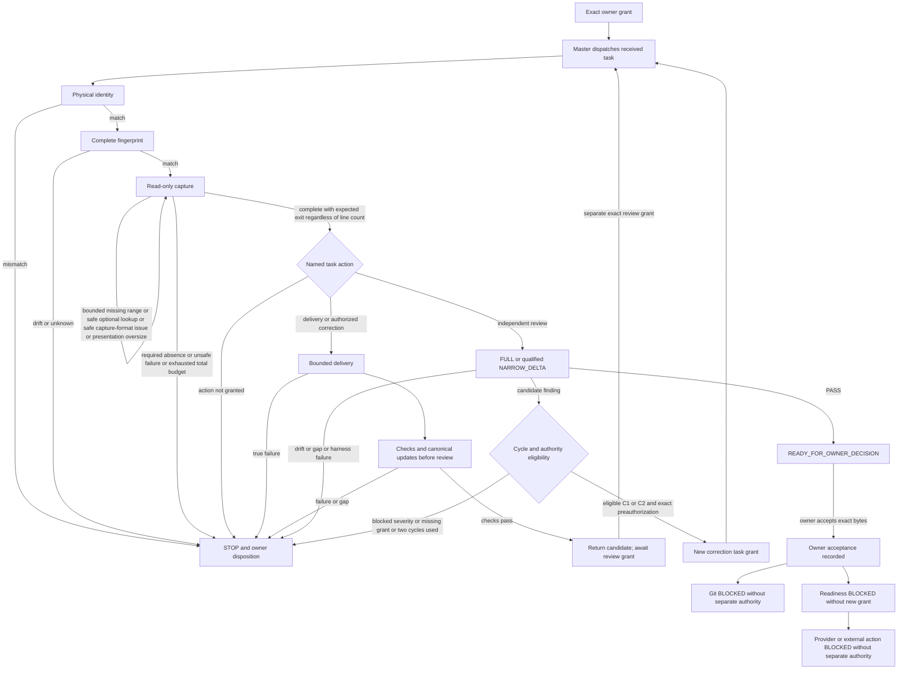

# Executor and Checkout Boundary — Plan

The original plan through **Verification Strategy** is historical. Its grants,
seven-path allowlist, inspection authority, and next gate are not renewed.
The S1 supplement below is the sole owner of the new proposed recipe and
graph. It does not activate operational policy or authorize execution.

The prospective **Capture Size Amendment — 2026-09-17** below explicitly
revises the S1 capture guards and C3/V3 recipe rows in this candidate. Earlier
historical scope and STOPs remain intact. Current correction authority comes
only from the new owner grant, not from the S1 proposal or its old budgets.

## Historical Correction Plan

## Objective and Files

Deliver AC1–AC8 from `requirements.md` as a minimal local documentary
candidate. Affected files are `AGENTS.md`, `docs/agents/executor-workflow.md`,
`docs/operations/master-control.md`, `tasks/lessons.md`, and the three files
in this spec directory. The AgentOps managed marker remains untouched.

## Assumptions and Preconditions

- Role: executor; `dispatch_owner`: master control task
  `019f71d6-632c-7870-bfa2-89513fdeb85a`, acting under the owner grant.
- Required physical repository:
  `/Users/diegovelez/Documents/PROJECTS/codex/yini-insurance-advisor`.
- Required common-dir: the repository's absolute `.git` directory.
- Required checkout: principal `main`, HEAD
  `bc1e4667e065d6b1f6f9001fee4ecd85b7cb31a5`, staged delta empty.
- The five readiness deltas bound in the current grant are permitted foreign
  state, not a demand for a clean working tree; preserve their hashes/modes.
- The declared quarantine directory is permitted and must not be touched.
- Route: owner-required Astra/high for this responsibility-boundary correction.

## Sequence

1. Observe physical cwd and Git root/common-dir before other repository work.
   Stop on mismatch without corrective `cd` or a new checkout.
2. Read applicable instructions and references in pages of at most 100 lines
   per source per call; continue incomplete capture through EOF. Establish
   HEAD/branch, index, exact foreign inventory, hashes, modes, and worktrees.
3. Inspect only calls, outputs, and turn_context from the one authorized R1H1
   session. Exclude reasoning and other sessions. Separate observations,
   falsifiable hypotheses, and unknown outcomes without a mutating replay.
4. Materialize this minimal spec, then change each allowed governance file
   once using one `apply_patch` operation per file. Preserve existing gates.
5. Read all candidate bytes in bounded pages. Inspect each tracked diff, run
   `git diff --check`, and check each untracked spec with
   `git diff --no-index --check /dev/null <file>`. Recheck inventory, hashes,
   modes, HEAD/branch/index, and the managed marker.
6. Return the candidate and actual checks in a terminal capsule. Master
   control owns the separately authorized later delegation test; this task
   neither dispatches it nor accepts this candidate.

## Risk and Correction Budget

Ambiguous role language can encourage recursive dispatch or a wrong checkout.
The correction is contractual prevention only; runtime hard enforcement and
future compliance are unproven. A worktree's presence alone cannot identify
which asynchronous request created it. Historical intent remains unknown.

One initial change pass is authorized, with at most two in-scope documentary
adjustments for expected inconsistencies found by checks. A true tool/write
failure, foreign drift, secret, or scope conflict stops; no mutating retries,
repair, cleanup, or product changes are permitted. Read-only pagination is
continued evidence capture and does not consume or renew mutation authority.

## Verification Strategy

Use direct Git read-only observations and standard-library byte/hash/mode
inventory only. Do not run repository validators whose purity is unproven,
application imports, product tests, or a new test harness. Map AC1–AC8 to the
changed text and explicit evidence limits; record executed results in the
terminal capsule without promoting them to independent review or acceptance.

## S1 Objective, Files, and Preconditions — 2026-09-16

Formalize the accepted decision map in exactly `spec.md`, `requirements.md`,
`plan.md`, `tasks.md`, and `validation.md` here. Preserve all prior historical
sections and the nine protected deltas listed in [requirements.md](requirements.md).
No executable script or new canonical owner is introduced.

The received task is already the isolated executor task; role and dispatch
owner remain as above. Principal physical root and common-dir must match before
other repository work. S1 starting HEAD is
`bc1e4667e065d6b1f6f9001fee4ecd85b7cb31a5` on `main`; staged is empty;
raw index SHA-256 is
`6573ee020f8a226351f8f889dc5cf80886ec3a1ed93940ce091e9757dadd87c7`.
The managed marker, from opening delimiter through closing delimiter excluding
the following LF, has SHA-256
`2ddf2376bd563fb19bd8b92eeb019b7d5b49cac8b41299d3a20adf1e5d804f47`.
These are historical S1 anchors, never defaults for a later grant.

S1 sequence: physical/fingerprint checks; bounded source reads; one initial
documentary edit pass; manual coherence, links and whitespace checks; final
inventory/preservation checks; terminal capsule. At most two documentary
adjustments may address expected in-scope inconsistencies. A write failure,
unknown mutation, drift, secret risk, or material scope conflict stops without
mutation retry. Documentary adjustments are not the future C1/C2 review cycles.

## Proposed Transition Graph

This graph describes future eligibility, not present authority. Every dispatch
requires a separately named owner grant and a fresh visible task. Master alone
dispatches; executors return receipts and never dispatch themselves. All tasks,
including correction and review, traverse physical identity, fingerprint, and
complete capture again. Local current rules remain authoritative until a new
grant materializes this proposal.



### Transition Table

The table is the textual contract for the same graph. `STOP` is terminal for
the received task: report the classified result and request owner disposition;
no outgoing edge resumes that task. Waiting and READY states also end their
task; a later edge begins only a separately authorized fresh task. S1 itself
ends at `READY_FOR_OWNER_SPEC_DECISION`, outside this future delivery graph.

| Edge | Actor | Precondition and input | Permitted action | Output / terminal |
|---|---|---|---|---|
| O → D | owner then master | Exact unused grant, task/role, route, checkout, fingerprint, paths, commands, budgets/stops | Administrative dispatch only | Received task; no expanded authority |
| D → P | executor or reviewer | Already received task; no cwd override | Observe physical identity | Match evidence or STOP |
| P → F / S | executor or reviewer | All three identities match / any mismatch | Continue read-only fingerprint / return mismatch | F or terminal STOP; no corrective cd |
| F → C / S | executor or reviewer | Exact manifest/index/ref/worktrees / drift, incomplete coverage, unknown mutation | Capture authorized sources / return classified mismatch | C or terminal STOP |
| C → C | same task reader | Known missing range, optional absent lookup, safe capture-format issue or presentation oversize; bound source and remaining total allowance | Page retained content or continue only authorized read-only capture | Missing evidence stays INCOMPLETE; oversize alone is no failure; no new gate or mutation retry |
| C → S | same task reader | Required source truly absent, unsafe/unexpected non-capture failure, secret risk, or exhausted total budget | Return symptom, classification and gap | Terminal STOP |
| C → A | same task reader | Complete authorized capture with expected exit, no unresolved required evidence; line count is not a guard | Check named action against current grant | No authority inferred from capture |
| A → L | delivery/correction executor | Exact delivery grant or eligible separately named C1/C2 grant | Only allowed delivery edits | Candidate; true failure → STOP |
| L → V | delivery/correction executor | Candidate within scope | Authorized checks and canonical updates, then checks of resulting bytes | Complete frozen candidate before review |
| V → W / S | delivery/correction executor | Checks PASS / failure or validation gap | Return candidate / classified stop | Terminal awaiting review grant or STOP |
| W → D | master | Separate exact independent-review grant bound to successor fingerprint | Dispatch fresh reviewer | New task; repeat preflight |
| A → R | independent reviewer | Exact review grant, same candidate, qualified scope | Read-only FULL or NARROW_DELTA assessment | PASS, finding, or classified stop |
| A → S | executor or reviewer | Action absent from current grant | Return authority mismatch | Terminal STOP |
| R → Q | independent reviewer | Classified PASS | Return evidence and residual risks | Terminal READY_FOR_OWNER_DECISION |
| R → E | reviewer then master/owner | Classified candidate finding with severity, cycle count, and acceptance-conflict status | Assess eligibility; no correction here | K only if exact authorization and limits permit |
| E → K → D | master | Eligible in-scope C1/C2, cycle count below 2, exact preauthorization, new task, successor binding, positive budgets | Dispatch correction; after delivery, W requires fresh review grant | No correction or review in the reviewer task |
| E → S / R → S | reviewer/master | Missing eligibility, P0/P1, unresolved acceptance conflict, 2/2 cycles, drift, harness defect, or validation gap | Return owner disposition | Terminal STOP; no hidden repair |
| Q → H | owner | Exact candidate and review receipt | Explicitly accept/reject/defer bytes | Acceptance only if owner says so; reject/defer leaves work stopped |
| H → G / N; N → X | owner/master | Acceptance is not a successor grant | Identify Git/readiness/provider authority still missing | BLOCKED BY AUTHORITY; no executable mutation command here |

FULL is mandatory without a prior applicable FULL or after a changed trust
boundary, public contract, or transversal topology. NARROW_DELTA requires that
prior FULL, unchanged boundaries, explicit delta qualification, and its own
review grant. Review result is independent from owner acceptance.

The installed validation-convergence contract owns finding severity: P0/P1
block, P2 requests correction/disposition, P3 recommends defer unless acceptance
conflicts. Unresolved disposition goes to the owner. Only an eligible candidate
finding may enter a preauthorized correction; no automatic correction follows
from severity. At most two semantic correction/review cycles follow FULL.
Retry/capture/harness events are not semantic cycles and cannot replenish them.
Exact positive coordination/action/depth budgets, where a future loop applies,
must be bound by that future grant under the installed authority contract.
S1 grants no loop, retry, harness repair, Git, or provider execution.

## Proposed Closed Read-Only Recipe

This is a textual invocation catalogue for future granted tasks, not an
instruction to execute it as a new S1 test. Each numbered command is a separate
tool call with its own exit and output. Use non-interactive zsh, `login:false`,
canonical executables, explicit arguments, no shell aliases, command chaining,
implicit `.zshrc`, or unquoted globs. Never hide failure with a success suffix.
`GIT_OPTIONAL_LOCKS=0` avoids optional locks; it does not make a mutator read-only.

### Bound Inputs

Before dispatch, the grant/receipt supplies the physical root, absolute common
directory, branch/HEAD, raw index digest, staged expectation, complete initial
and expected successor manifests, managed marker identity, worktree inventory,
allowed paths, source list and required/optional designation, exact search
patterns, optional task IDs, read bounds, and verification selection. No input
is recovered by guessing a directory, command, branch, or task identity.

Manifest rows have exact repository-relative path, two-column Git status,
regular-file kind, numeric mode, and SHA-256. Preserve spaces in status and use
NUL-delimited status parsing. Explicit absent outputs have absence expectations;
do not hash nonexistent files. Status/counts come from the entire manifest;
6M/8?? is merely S1's expected successor. Relevant ignored inputs require exact
governance; pre-existing excluded ignored state is not read, hashed, or consumed.

Partition governed inputs, allowed foreign/ignored state, forbidden state, and
derived evidence without overlap. Inventoried non-ignored foreign deltas have
exact preservation hashes; excluded ignored state has only its declared scope.
Derived evidence names the algorithm/version and cannot replace raw identities.
If required coverage cannot be established without reading excluded data, STOP.
Final hashes are returned in the receipt, never embedded in a file whose hash
they purport to identify. New expected successor identities are observed from
authorized edits; foreign identities remain anchored to the original grant.

### Invocation Order and Results

| Step | Literal invocation or bound family | Required result |
|---|---|---|
| P1 | `pwd -P` | Exact physical cwd; first shell call has no workdir/cwd override |
| P2 | `GIT_OPTIONAL_LOCKS=0 git rev-parse --show-toplevel` | Exact granted root |
| P3 | `GIT_OPTIONAL_LOCKS=0 git rev-parse --path-format=absolute --git-common-dir` | Exact granted absolute common-dir; stop if normalization is unavailable |
| F1 | `shasum -a 256 .git/index` | Raw index bytes match; only valid for a principal checkout with physical `.git/index` |
| F2 | `GIT_OPTIONAL_LOCKS=0 git symbolic-ref --quiet --short HEAD` | Exact branch; detached expected case has documented exit 1 and no branch |
| F3 | `GIT_OPTIONAL_LOCKS=0 git rev-parse HEAD` | Exact HEAD |
| F4 | `GIT_OPTIONAL_LOCKS=0 git status --porcelain=v1 -z --untracked-files=all` | Exact complete path/status inventory; no ignored-data consumption |
| F5 | `GIT_OPTIONAL_LOCKS=0 git diff --cached --name-status` | Exact staged expectation, empty for S1 |
| F6 | `GIT_OPTIONAL_LOCKS=0 git worktree list --porcelain` | Exact granted registered worktrees; no inference about other trees' contents |
| F7 | Inventory invocation below | Exact kind/mode/hash, absence checks, marker digest |
| C1 | `rg --files -- <known-directory>` | Locate files only in a known authorized directory before selecting reads |
| C2 | `rg -n -e '<bound-pattern>' -- <explicit-known-files>` | Bounded lookup; match or documented optional no-match |
| C3 | `sed -n '<start>,<end>p' '<exact-source>'` | One source/call; initially target 100 lines, then page retained content by the presentation size control below, including long lines; continue missing ranges through EOF |
| C4 | `wc -l -- '<exact-source>'` | Optional read-page bound; final unterminated line must still be captured |
| C5 | `read_thread` tool with `threadId=<authorized-id>`, `turnLimit=1`, `includeOutputs=true`, `maxOutputCharsPerItem=6500` | Conditional only if exact task evidence is required; native envelope and authorized content guarded before traversal |
| V1 | `GIT_OPTIONAL_LOCKS=0 git diff --check -- <explicit-allowed-tracked-files>` | Whitespace check restricted to granted candidate |
| V2 | `GIT_OPTIONAL_LOCKS=0 git diff --no-index --check -- /dev/null '<one-allowed-untracked-file>'` | One file/call; whitespace diagnostics absent |
| V3 | `GIT_OPTIONAL_LOCKS=0 git diff -- '<one-allowed-tracked-file>'` | Optional selected read-only diff: retain result/exit/source first, page retained content before emission using the amendment below; never append `head` or lose exit through a pipeline |
| Z | Repeat P1–P3, F1–F7 against expected successor | Postflight identity, inventory and preserved-state evidence; not mutation replay |

This principal-checkout recipe does not silently adapt F1 for a linked
worktree. If the owner selects one, its fresh grant must explicitly bind the
per-worktree index's physical path and read-only observation before execution.
That is an input/recipe decision, not permission to select a checkout or invent
Git commands. A missing `.git/index` in this recipe blocks; never create it.

F7 is the following literal textual template, not executed in S1. Replace only
the four `BOUND_...` input tokens with grant-bound Python data literals before
dispatch; leave the body unchanged. Each row is `(path, status, mode, digest)`.
The receipt must compare printed statuses with F4; this body observes filesystem
bytes and does not independently observe Git status. `AGENTS.md` must be a row.
All existing/protected rows require exact digests. Only explicitly allowed new
candidate identities may use `None`, and only for a separately bound initial
candidate capture; they emit `OBSERVED_NEW`, not an unchanged-fingerprint PASS.
The next comparison must bind those actual digests in the successor manifest.
Input lists must be complete. Estimate capture needs against the granted total
budget before invocation and page retained output under the amendment below;
do not truncate the manifest or apply a 100-source-line rule to its JSON/output.
Insufficient total allowance stops before invocation.

```sh
PYTHONDONTWRITEBYTECODE=1 .venv/bin/python - <<'PY'
from pathlib import Path
import hashlib
import stat

rows = BOUND_MANIFEST_ROWS
absent = BOUND_ABSENT_PATHS
new_candidates = BOUND_NEW_CANDIDATE_PATHS
marker_expected = BOUND_MARKER_SHA256
assert rows and len({row[0] for row in rows}) == len(rows)
assert set(absent).isdisjoint(row[0] for row in rows)
assert set(new_candidates) <= {row[0] for row in rows}

def bound_path(name):
    file_path = Path(name)
    assert name and not file_path.is_absolute() and '..' not in file_path.parts
    current = Path('.')
    for part in file_path.parts:
        current = current / part
        assert not current.is_symlink(), name
    return file_path

agents_bytes = None
for name, git_status, expected_mode, expected_digest in rows:
    file_path = bound_path(name)
    file_mode = file_path.lstat().st_mode
    assert stat.S_ISREG(file_mode), name
    assert stat.S_IMODE(file_mode) == expected_mode, name
    data = file_path.read_bytes()
    digest = hashlib.sha256(data).hexdigest()
    if expected_digest is None:
        assert name in new_candidates, name
        result = 'OBSERVED_NEW'
    else:
        assert digest == expected_digest, name
        result = 'MATCH'
    print(result, repr(git_status), oct(expected_mode), digest, name)
    if name == 'AGENTS.md':
        agents_bytes = data
for name in absent:
    file_path = bound_path(name)
    assert not file_path.exists() and not file_path.is_symlink(), name
    print('ABSENT', name)
assert agents_bytes is not None
opening = b'<!-- agentops-engineering:start -->'
closing = b'<!-- agentops-engineering:end -->'
assert agents_bytes.count(opening) == agents_bytes.count(closing) == 1
start = agents_bytes.index(opening)
end = agents_bytes.index(closing) + len(closing)
assert start < end - len(closing)
marker_digest = hashlib.sha256(agents_bytes[start:end]).hexdigest()
assert marker_digest == marker_expected
print('MARKER_MATCH', marker_digest)
PY
```

No recursive traversal, application imports, subprocess, writes, index/tree
generation, network, or reads outside bound paths are allowed. This is a
documented invocation, not a delivered executable validator. Missing runtime
or any failed assertion stops; do not install, repair, or edit the body in the
received execution task. The recipe does not support arbitrary file kinds;
a non-regular candidate requires a separate owner-bound contract decision.

These are closed invocation families: placeholder substitution is limited to
grant-listed literals and page ranges. Shell metacharacters in literals require
correct shell quoting, not JSON serialization. No other invocation is implicit.
Separate documentary link/coherence checks may be selected only by the S1 grant;
they are not additions to this reusable runtime recipe.

### Exit Semantics and Complete Capture

Record each exit/result, source and range. Normal commands require exit `0`
and matching complete output. Exceptions are narrow:

- `git symbolic-ref` exit `1` means detached only when the grant expects it;
  it is a mismatch for a granted branch.
- `rg` exit `1` means no match. An optional lookup can record absence and read
  another already-authorized known source. Exit `2` is an error; a nonexistent
  optional lookup directory is recoverable only after bounded verification of
  its absence via the known parent inventory, without inventing a replacement.
- `git diff --no-index --check` can report a normal content difference with
  exit `1`; that is acceptable only with complete output showing no whitespace
  diagnostic and the expected regular candidate file. Exit `0` with no
  diagnostics also passes the whitespace check. Whitespace diagnostics fail
  regardless of exit; error/usage output or any other exit is not a PASS.
- A shell/tool timeout, truncation flag, missing text, or incomplete page never
  proves the underlying check passed. Recover only its missing authorized
  read-only evidence if safe; otherwise report an unobserved result and STOP.

Capture wrapper behavior is owned by the
[C1 helper](../../docs/agents/executor-workflow.md#recoverable-read-only-capture).
Emit type/error/block metadata, protect parsing, validate container and inner
record shape, and check nested truncation before traversing records. An
`isError`, malformed/invalid shape, or plain-text error is never a valid result.
Safe native text may be retained as error evidence; it cannot masquerade as
parsed records or content completion. If needed, use an already-authorized
canonical record as a bounded alternative; no new task/session access is implied.

For a paginated `read_thread`, use only a returned cursor to obtain a missing
authorized range, retaining `turnLimit=1` and the same output bound. Do not
request reasoning or raw transcript dumps. If no supported bounded continuation
can complete the required item, return the gap. Successful envelope, helper
classification, or terminal marker alone never proves whole-source capture.

### Recovery Boundary

For each recovery record: symptom, source/range, classification, next bounded
read-only action, remaining gap, and completion outcome. Safe missing-range
capture and optional lookup absence are C → C within the same task and the
predeclared read allowance. They are not semantic C1/C2, a mutating retry, a
second harness repair, a new owner gate, or permission to rewrite the helper.

Current S1 explicitly permits this bounded search/capture exception. Future
tasks require its operational adoption or their own exact owner exception.
There is no unbounded loop: the future grant must fix positive read-call/page
limits and authorized alternative sources before dispatch. Exhaustion, a truly
missing required source after safe lookup, unknown state change, write failure,
secret risk, permission escalation need, unexpected non-capture failure, or
material conflict goes to STOP. A later PASS cannot cure a prior mismatch.

## Capture Size Amendment — 2026-09-17

This prospective local amendment replaces the S1 presentation hard cap of
"at most 100 lines" in C3/S1-AC06 and aligns V3 and the graph/table above.
The original Historical Correction Plan remains unchanged. It neither excuses
an explicit hard grant violated in an earlier task nor retroactively resumes
or passes its STOP. The new owner grant expressly applies these capture
semantics from the start of this correction, with hard totals of 160 tool
calls and 200 displayed pages, one initial edit pass and two documentary
adjustments. No action starts with exhausted required allowance; balances do
not survive task closure. Future tasks bind their own positive total budgets.

100 lines is an initial pagination target only. It is not a safety invariant,
acceptance criterion, universal tool input limit, source-code limit, or reason
to reject a complete JSON manifest/command result. Presentation is controlled
by configurable characters/tokens: this grant targets at most 100 lines and
at most 6500 characters per displayed content fragment. Exceeding a display
target requires bounded capture handling, not an automatic terminal failure.
Never infer token counts from character counts. Source, exact range, native
exit/result, and completeness must be recorded independently of display size.
Master must bind those controls explicitly rather than invent a hard 100-line
constraint for every future command. A separately explicit hard grant remains
binding until changed by its owner; this amendment is no implicit override.

### Capture Decision Table

Classification here is manual application of the contract, not a new parser
or runtime enforcer. Oversize alone supplies no `HARNESS_DEFECT` to the facade;
that facade maps a classification supplied by its caller, not line counts.

| Observation | Capture state and eligible handling |
|---|---|
| Complete authorized output, expected exit, more than 100 lines | Complete evidence after retained pages are inspected; no size failure; C → A when other evidence is complete |
| One line exceeds 6500 characters | Split at character offsets, retain exact text and source; presentation C → C, not a state failure |
| Truncation flag or missing range | INCOMPLETE; C → C only for bounded safe recovery within remaining total budget; exit 0 alone proves no completeness |
| Unexpected Git/tool exit or error diagnostics | Preserve error; real non-capture failure is STOP, never promoted to PASS by pagination |
| Identity drift, unknown/failed mutation, secret/unsafe capture, or scope conflict | STOP; no repair, escalation, cleanup, or renewed authority |
| Required total call/page allowance exhausted | STOP with explicit gap; size recovery does not replenish budgets |
| Missing mutation output | Never replay the mutation; retained authorized evidence or separately bound read-only observation only, otherwise return gap/STOP |

### Retained Diff Capture Recipe

Bind an exact authorized tracked file, command and baseline (add `HEAD` only
when explicitly selected), source identity/fingerprint, expected exit, total
budget and runtime output capacity before V3. Capture the read-only result in
a retained tool buffer before emitting its content. For this runtime, the
concrete sequence is a `tools.exec_command` call with `login:false`, exact V3
command, and a grant-selected `max_output_tokens`, followed by
`store("v3-result", result)` in `functions.exec`. Keep its `exit_code`,
`chunk_id`, output and any truncation/session metadata alongside the bound
source; never print the whole result first. If it reports a running session,
capture its completion/exit within the same allowance before assessing it.
The token cap can truncate capture: inspect native truncation metadata and
warnings; a successful call or EOF of a truncated buffer proves no completion.

Apply the following literal to the retained authorized output, then emit only
the next page(s) that fit the outer tool response capacity and budget. Each
page has zero-based, end-exclusive character offsets into the retained text;
record its buffer/source identity and native exit separately. A line may span
pages. This is an ephemeral presentation helper, not an executable repository
script or a semantic classifier. No shell `| head`, pipeline masking an exit,
discarded suffix, or fabricated missing content is eligible.

```js
function retainedCapturePages(content, maxChars = 6500, targetLines = 100) {
  const pages = [];
  let start = 0;
  while (start < content.length) {
    let end = Math.min(start + maxChars, content.length);
    let lines = 0;
    for (let i = start; i < end; i++) {
      if (content[i] === "\n" && ++lines === targetLines) {
        end = i + 1;
        break;
      }
    }
    pages.push({ start, end, content: content.slice(start, end) });
    start = end;
  }
  return pages;
}
```

Bind positive integer `maxChars` and `targetLines` before calling this helper;
it is not an input validator. Join inspected page content and compare with the
retained source; retain its original exit unchanged even for an error. The
helper can preserve a truncated buffer perfectly, so equality is necessary
but insufficient: whole-source completeness requires native completion and
all authorized ranges, without truncation flags or unresolved gaps.

If this runtime cannot retain the complete buffer, or only an incomplete
native result is retained, mark INCOMPLETE. Continue only a missing range from
the authorized source under the remaining total budget. A bound read-only
re-observation is eligible only after rechecking source/fingerprint identity,
retaining the new exit and exact ranges; changed identity stops. Do not invent
a new source or range API, or claim recovery when the available tool cannot
provide the missing content. Never rerun an originating mutation. A real
command error stays an error after a complete capture.

### Current Correction Verification and Scope

Affected files are `docs/agents/executor-workflow.md`, `tasks/lessons.md`, and
this directory's five Markdown files only. Starting principal `main` HEAD is
`24aeee28207de366245167b1c3065da4cffcd172`; raw index SHA-256 is
`d6c8c5d1f042101e9010a296f843b1678c71b828d0d578891a371f78f3250f57`.
The five owner-bound readiness deltas remain foreign and byte-for-byte intact.
No new file, AGENTS/master/adapter/plugin/config/runtime/CI edit is included.

Execute invented ephemeral fixtures against the literal above, checking page
concatenation, offsets and preserved native exit. Manually assess the decision
table's error/drift/budget/mutation cases, explicitly distinguishing manual
contract evidence from executable pagination. No app import or product test
is permitted. Check seven-document links/coherence, exact diffs, scoped
whitespace and twelve-delta postflight with foreign/index/HEAD/marker intact.
Record real observations in [validation.md](validation.md#capture-size-diagnosis--2026-09-17);
no claim of plugin change, runtime root cause or future enforcement follows.

### Forbidden Inspection Substitutions

The strings `git write-tree`, `git read-tree`, `git update-index`, and
`git hash-object -w` are negative review examples, never runnable steps.
No staging, commit, ref edit, checkout/worktree creation, push, cleanup,
provider/network call, installation, or external action belongs in this recipe.

## Canonical Materialization and S1 Verification

Future delivery must update the recipe/recovery pointers in
`docs/agents/executor-workflow.md` and a narrowly evidenced lesson in
`tasks/lessons.md` before independent review. Any necessary AGENTS/master
pointer alignment must be explicitly allowed by that future grant. Do not copy
the graph, parser, or universal Operating Model into parallel semantic owners.
Current S1 leaves all four governance/lesson paths unchanged.

S1 verifies only its document bytes, relative links, AC/graph/table/DoD
coherence, exact five-path edit scope, nine-path preservation, Git/marker
identity, and selected tracked/untracked whitespace. No full recipe execution,
wrapper fixtures, runtime graph tests, product tests, external rendering, or
formal review is authorized. The final capsule owns the actual observations;
[validation.md](validation.md) separates future NOT_RUN scenarios and history.
